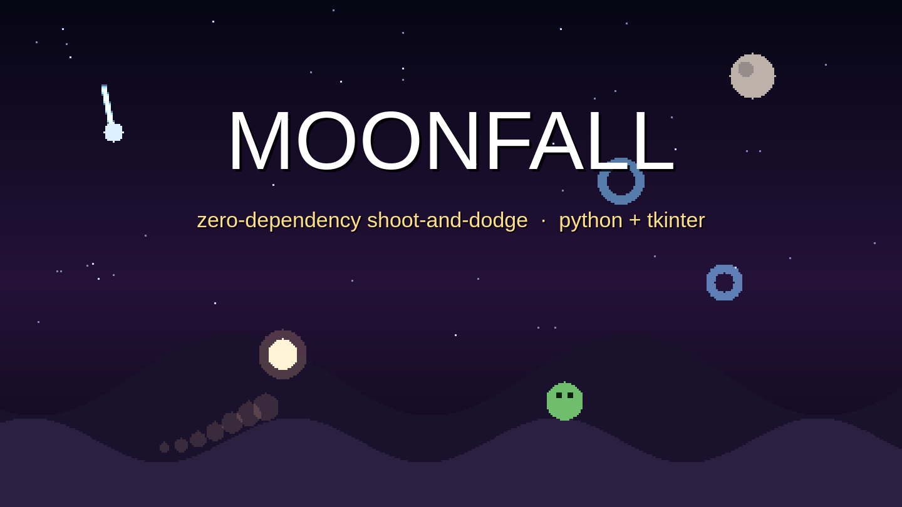
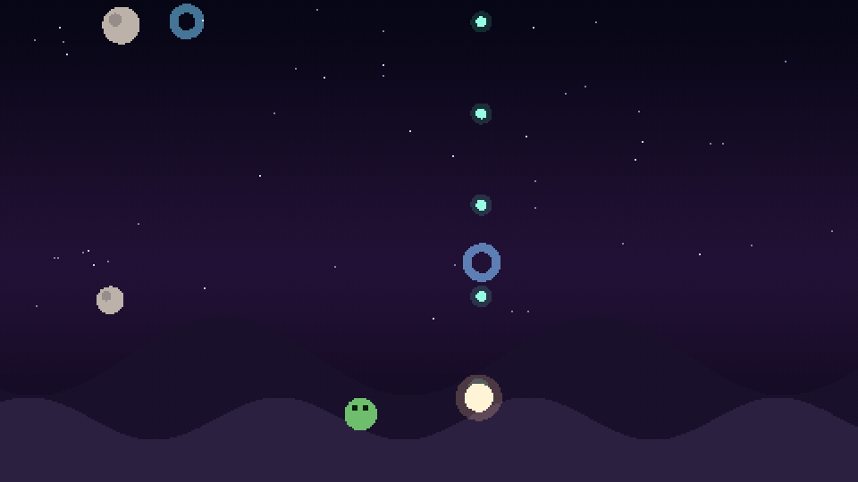
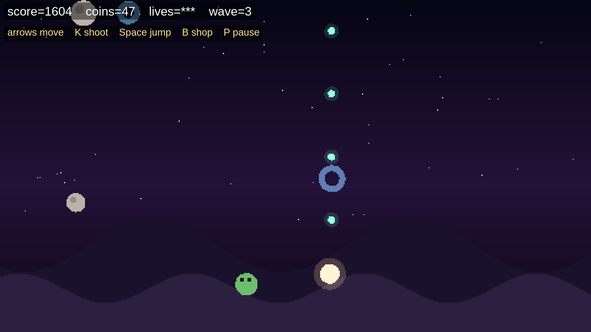
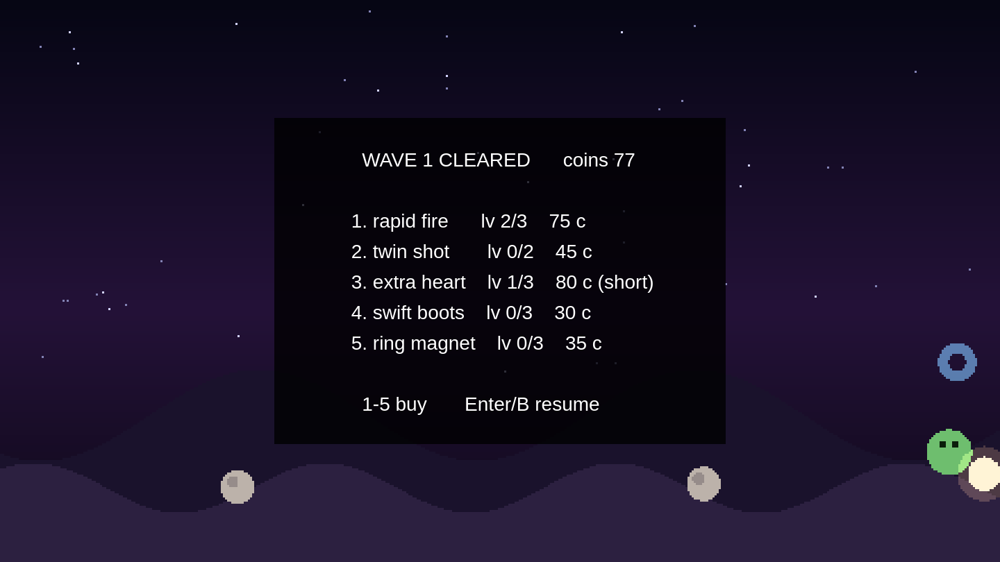

<p align="center">
  
</p>

<p align="center">
  <a href="https://github.com/shubh72010/moonfall/blob/main/LICENSE"></a>
  
  
  
</p>

<p align="center">
  The moon is falling. Ride the hills, shoot what drops, jump what crawls —
  and spend the coins before wave 2 finds you.<br><br>
  
</p>

## Screenshots

| Gameplay | Shop |
|---|---|
|  |  |

## How to play

```
python3 game.py          # Python 3.10+ with tkinter, nothing else
python3 game.py --selftest
```

| Key | Action |
|---|---|
| ← → / A D | ride the hill |
| K / X | shoot — kills drop coins |
| Space / W / ↑ | jump |
| B | open the shop |
| 1 – 5 | buy upgrades in the shop |
| Enter / Space / B | leave the shop |
| P | pause · R restart · Q quits |
| F11 | fullscreen |

### Threats

| Enemy | Appears | Counter |
|---|---|---|
| Falling moon | wave 1 | strafe it or shoot it — don't stand under it |
| Ground walker | t > 8s | jump it or shoot it (only one spawns at a time) |
| Comet | t > 20s | fast and diagonal — keep moving |

### The shop

Opens automatically at **0:20**, then every wave (30s). Kill coins buy:

| # | Upgrade | Max | Base cost |
|---|---|---|---|
| 1 | rapid fire | 3 | 25 c |
| 2 | twin shot | 2 | 45 c |
| 3 | extra heart | 3 | 40 c |
| 4 | swift boots | 3 | 30 c |
| 5 | ring magnet | 3 | 35 c |

Prices scale with each level. Rings give **+6 c** and stack a **×5 combo**
for 4 seconds; the three bounties pay 4 / 8 / 12 c (moon / comet / walker).

## Under the hood

- **`game.py`** — state machine, enemies, shop, 480×270 frame loop into
  tkinter via `PhotoImage.zoom`, ~7.7 ms per frame (budget: 40 ms).
- **`engine.py`** — the zero-dependency 2D paint library: `sky`, `hill`,
  `disc`, `ring`, `line`, `fade` over a raw RGB buffer, PNG writer,
  caption filters, ffmpeg mux. `python3 engine.py` runs its selftest.

Screenshots and the GIF were rendered headlessly through the game's own
`draw()` and composed with ffmpeg — the same pipeline the engine uses for
film captions.

## License

[MIT](LICENSE)
